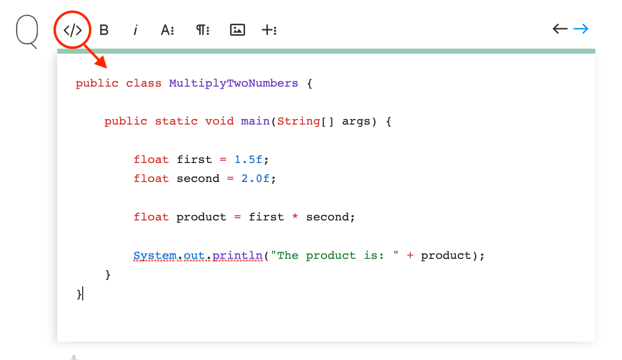

# Froala Syntax Highlighter

Syntax highlighter tool based on [Shiki](https://github.com/shikijs/shiki/tree/main/packages/shiki) with programming language detection in the **Froala editor**. This package is compatible with Froala editor versions 3 and 4.



## Table of Contents

- [Requirements](#requirements)
- [Install instructions](#install-instructions)
- [Services](#services)
- [Documentation](#documentation)

## Requirements

- **npm** (_> v6.13.4_)
- **froala** (_>= 3_)

## Install instructions

### General installation instructions

1. Install the npm module:

   ```bash
   npm install froala-syntax-highlighter
   ```

2. Load the module into your project:

   ```js
   <script src="node_modules/froala-syntax-highlighter/lib/index.js"></script>
   ```

3. Update Froala configuration:

- Add Syntax Highlighter button to the toolbar:

  ```js
  ${}.froalaEditor({
    // Enable the plugin.
    pluginsEnabled: ['syntaxHighlighter'],

    // Add the buttons to the toolbar and image edit buttons
    toolbarButtons:   ['highlightCode'],
    toolbarButtonsMD: ['highlightCode'],
    toolbarButtonsSM: ['highlightCode'],
    toolbarButtonsXS: ['highlightCode'],
    imageEditButtons: ['highlightCode'],
  })
  ```

  Notice the example assumes this directory structure:

  ```
  └───index.html
  └───node_modules
      └───froala-syntax-highlighter
  ```

### Angular installation instructions

1. Run the following through the terminal

> ###### **Caution**
>
> **Note:** you can set the froala-editor and angular-froala-wysiwyg versions, as showed in the comment below, which lies between 3 and 4. In case the version is not specified, the latest stable version will be installed.

```bash
ng new $APP_NAME
# Notice that **$APP_NAME** needs to be replaced by the name that you choose.

cd $APP_NAME

npm install --save angular-froala-wysiwyg

npm install --save froala-syntax-highlighter
```

2. Open the `src/app/app.module.ts` file and add:

```ts
// From Froala instructions.
// Import all Froala Editor plugins.
import "froala-editor/js/plugins.pkgd.min.js";

// Expose FroalaEditor instance to window.
declare const require: any;
(window as any).FroalaEditor = require("froala-editor");
require("froala-syntax-highlighter/lib"); // Import WIRIS Mathtype formula editor.

// Import Angular plugin.
import {
  FroalaEditorModule,
  FroalaViewModule,
} from "angular-froala-wysiwyg";

...

@NgModule({
    ...
    imports: [... FroalaEditorModule.forRoot(), FroalaViewModule.forRoot() ... ],
    ...
})
```

3. Open `.angular.json` file and add:

```json
"styles": [
   "src/styles.css",
   "./node_modules/froala-editor/css/froala_editor.pkgd.min.css",
   "./node_modules/froala-editor/css/froala_style.min.css"
 ]
```

4. Open `src/app/app.component.ts` and replace all with:

```ts
import { Component } from '@angular/core';

@Component({
  selector: 'app-root',
  templateUrl: './app.component.html',
  styleUrls: ['./app.component.css'],
})
export class AppComponent {
  // Set App Title.
  title = 'Angular froala demo';

  // Initialize the editor content.
  public content: string = '<p class="text">const hello = "hello";</p>';

  // Set options for the editor.
  public options: Object = {
    pluginsEnabled: ['syntaxHighlighter'],
    toolbarButtons: ['highlightCode'],
  };
}
```
